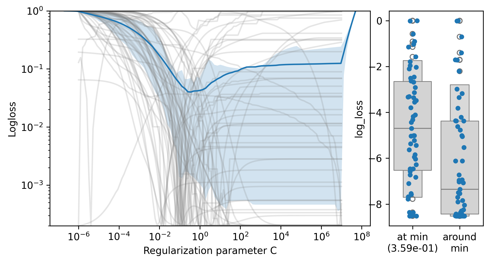
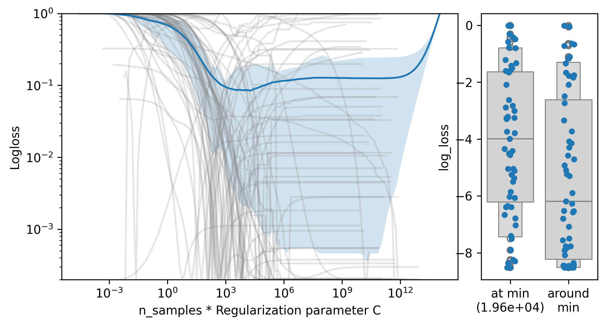
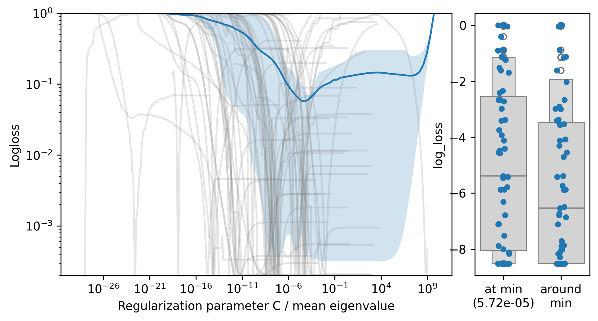
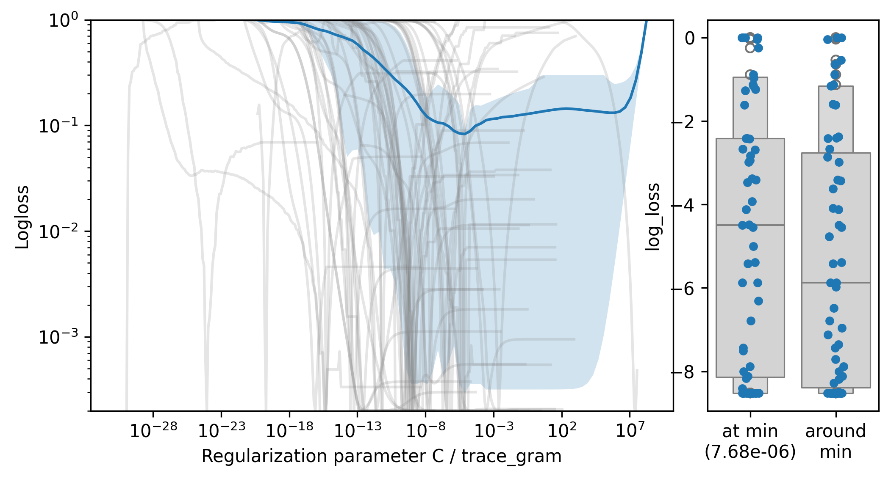

# Studying parametrization and defaults for regularization in LogisticRegression

This repository runs empirical studies across many real-life tabular
datasets to come up with good choices of regularization parameter for
LogisticRegression.

## Regularization paths

The figures show:

**Right**: Path of regularization parameter (C) for all the datasets,
plotted with different reparametrization as a function of data
characteristic

**Left** Using the paths, log-loss values for a fixed C located at the
minimum of the average loss across datasets, or simulating a fixed C
across a small number of neighboring values of C.

To run the computation: `run_path.py`

To make the plots: `plot_logistic_path.py`

